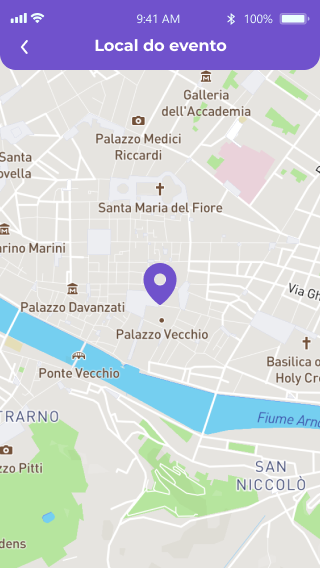
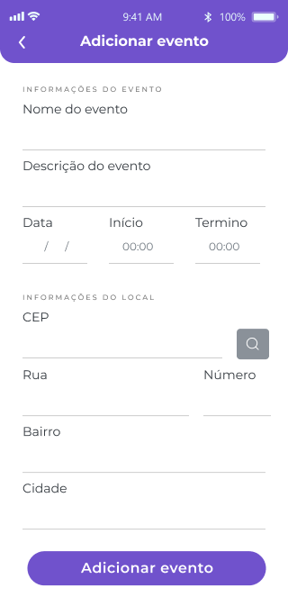
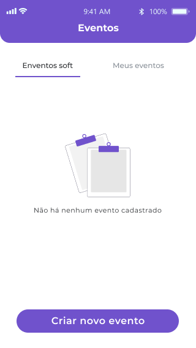

# schedule-app

## Layout

- Splash

  

- Autenticação

  
  

- Cadastro, listagem e detalhes de eventos

  
  
  
    

- Erros e feedbacks

  
  
  
  

## Features

- Listar detalhes de um endereço à partir de um cep
- Favoritar endereço utilizando o armazenamento local
- Ver endereço no mapa

## Arquitetura

Baseado nos conceitos de clean architecture prosposto por Robert C. Martin, a aplicação está dividida em 4 camadas:

- Regras de Negócio Corporativas
- Regras de Negócio da Aplicação
- Adaptadores de Interface
- Frameworks & Drivers (Externos)

  

