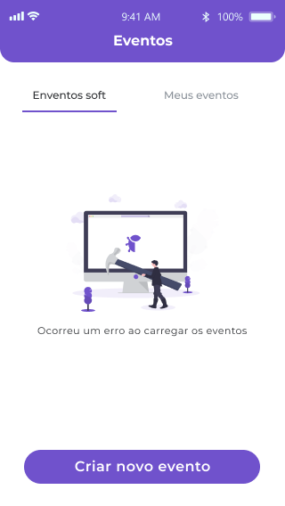
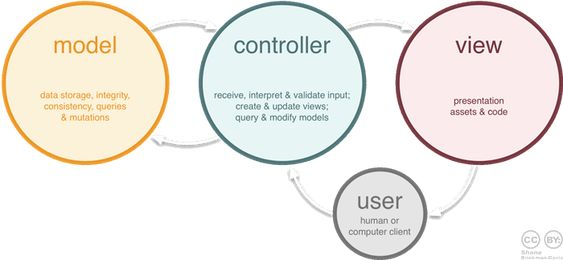

# schedule-app

## Layout

- Splash

  

- Autenticação

  
  

- Cadastro, listagem e detalhes de eventos

  
  
  
    

- Erros e feedbacks

  
  
  
  

## Features

- Autenticação (Firebase)
- Listar eventos via consumo de API
- Ver detalhes do evento
- Ver local no Mapa
- Criar evento (armazenamento local)

## Arquitetura

  

